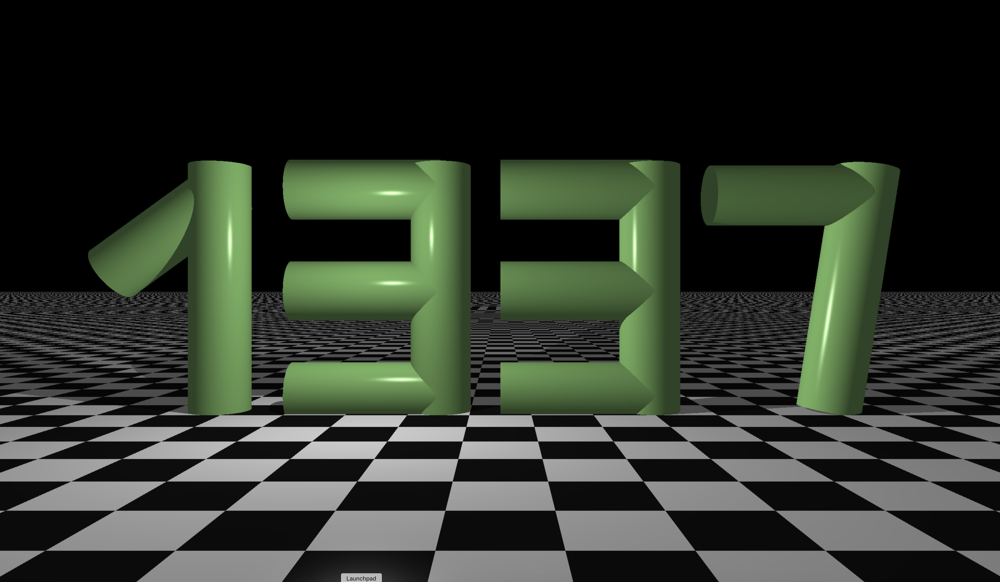
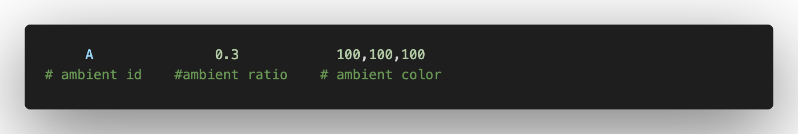
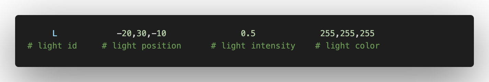
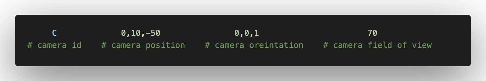
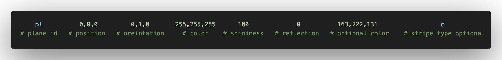
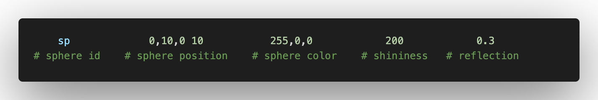
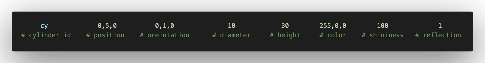
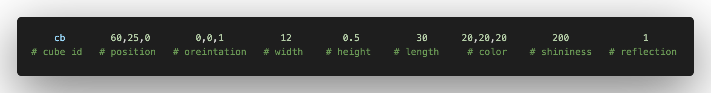

# miniRT
## My first RayTracer
This project is an introduction to the beautiful world of Raytracing


1337 image generated by miniRT

### What is ray tracing
In 3D computer graphics, ray tracing is a technique for modeling light 
transport for use in a wide variety of rendering algorithms for
generating digital images.

### How it works?

Just loop over all pixels and generate a ray for each one, then see if intersects with any object and calculate the color for this pixel, sounds simple isn't it, well it's not.

<b>First we have to generate the ray for each pixel</b>

Here is some resourses <br>
<a srs="https://www.scratchapixel.com/lessons/3d-basic-rendering/ray-tracing-generating-camera-rays/generating-camera-rays">https://www.scratchapixel.com/lessons/3d-basic-rendering/ray-tracing-generating-camera-rays/generating-camera-rays</a>

## install
```
git clone https://github.com/YassineEddyb/miniRT_42 && cd miniRT_42 && make
```
## How to use it

There is three conifg object that are mandate to have

Ambient


Light


Camera


And foor basic shapes that are (optional, will not entirely cause if you leave it empty you will only see a black window)

Plane


Sphere


Cylinder


Cube



